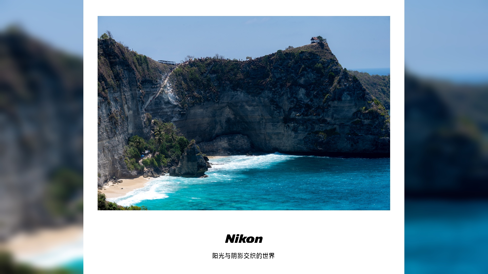

# FrameApp

This Python application is designed to add a frame and blur the background of an image. It uses OpenCV and Matplotlib libraries to process images.



## How to Use

Clone this repository to your local machine.
Install the required Python libraries. You can do this by running pip install -r requirements.txt in your terminal.
Run the src.py script. You can do this by running python src.py in your terminal.

## Functionality

The main function in this application is add_frame_and_blur_background_opencv(). This function takes four arguments:

image_path: The path to the original image.

- output_path: The path where the output image will be saved.
- logo_path: The path to the logo image that will be added to the original image.
- screen: The dimensions of the screen.

The function works as follows:

1. It loads the original image and calculates its aspect ratio.
2. It resizes the image to fit within a 16:9 frame, maintaining the original aspect ratio.
3. It creates a new image with a white background and a 16:9 aspect ratio.
4. It pastes the resized image onto the center of the background.
5. It loads and resizes the logo, then pastes it onto the image.
6. It creates a blurred background image from the original image.
7. It pastes the original image onto the blurred background.
8. It saves the result to the specified output path.

Example
To use this application with your own images, you can modify the original_image_path, output_image_path, and logo_path variables at the bottom of the src.py script.

For example:

```python
original_image_path = r'path_to_your_image.jpg'
output_image_path = r'path_to_save_your_output.jpg'
logo_path = r'path_to_your_logo.png'
add_frame_and_blur_background_opencv(original_image_path, output_image_path, logo_path)
```

This will process your image and save the result to the specified output path.
